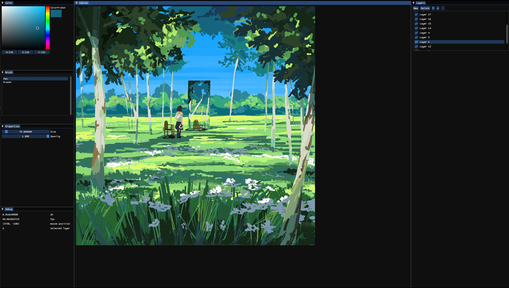

# Brush App

Sample Illustration: 8Kx8K, 17 layers. Original art by [Denis Istomin](https://www.artstation.com/artwork/wrboNw) 

A toy project to learn about implementing a paint app similar to Clip Studio Paint. 
We use various optimisation techniques (mostly taking advantage of the GPU) to ensure 
that our app runs smoothly (60 fps) even for large image sizes and high layer counts 
(8K x 8K, and up to 200 layers). 

Current features include:

- Pen and eraser 
	- Smooth(ish) brush interpolation
- Color picker tool
- Layers
	- Toggle visibility
	- Alpha locking
- Pen tablet support
	- Pen pressure support

## Build
Install GLAD, GLFW, and OpenGL (in future, this will be done via vcpkg), and 
modify `CmakeLists.txt` to point to these dependencies. Then fetch submodules 
and build with `cmake`.

```sh
git submodule update --init --recursive
cmake -B build
cmake --build build
```